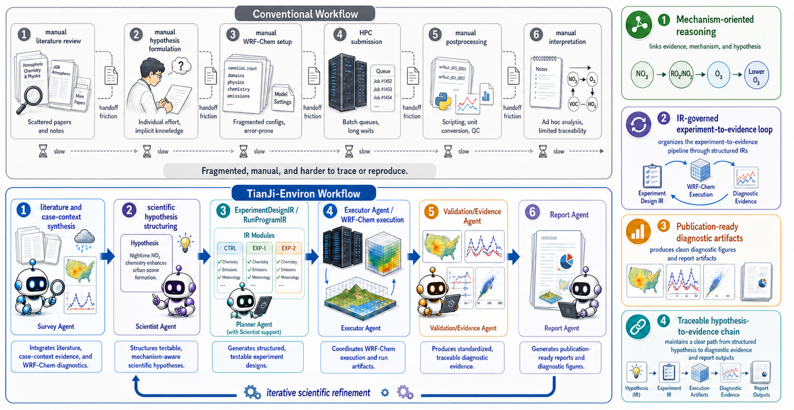

# TianJi-Environ

<div align="center">

### An Autonomous AI Scientist for Atmospheric Environmental Research

[](#citation)
[](#repository-structure)
[](LICENSE)
[](https://ruc.noaa.gov/wrf/wrf-chem/)

Haoluo Zhao, Hongchun Zhang, Nan Li, Jing-Jia Luo, Kaikai Zhang, Mengyang Yu, Nan Chen, Tao Song, and Fan Meng

</div>

## News

- **2026-06-05**: Initial supporting artifacts released, including manuscript figures, source data, H1/H2 case-study summaries, diagnostic-task examples, and system-trace summaries.
- Source code and additional reproducibility materials will be released and maintained in this repository as the project is prepared for public use.

## Overview

TianJi-Environ is an auditable AI Scientist prototype for atmospheric-chemistry mechanism validation. The system is designed to organize literature evidence, mechanism hypotheses, WRF-Chem branch experiments, diagnostic evidence, and qualified scientific interpretation into a traceable research workflow.

The manuscript studies two representative atmospheric-environmental problems:

- **H1: Aerosol-radiation interaction and ozone response** over the North China Plain.
- **H2: Black-carbon feedback and wintertime PM2.5** over the Guanzhong Basin.

This repository currently hosts curated supporting artifacts rather than a full WRF-Chem runtime environment. It is organized around the manuscript logic so that readers can inspect the evidence chain, figures, summarized branch outputs, diagnostic examples, and system-level traces used in the paper.



## Contributions

- We formulate atmospheric-chemistry mechanism validation as an auditable AI Scientist task grounded in complex numerical modelling.
- We provide supporting artifacts for a WRF-Chem-based multi-agent workflow that connects mechanism hypotheses, branch experiments, diagnostic evidence, and qualified conclusions.
- We release curated H1/H2 case-study summaries, manuscript figure source data, diagnostic-task examples, and system-trace artifacts for manuscript-level inspection.

## Repository Structure

```text
TianJi-Environ/
  README.md
  LICENSE
  CITATION.cff
  NOTICE.md
  docs/
    reproducibility.md
    artifact_manifest.csv
    third_party_data.md
  paper_artifacts/
    figures/
    source_data/
  case_studies/
    h1_ari_ozone/
    h2_bc_pm25/
  diagnostic_tasks/
    sa_01_mda8_o3_peak/
    sa_03_pm25_episode/
    sa_05_o3_meteorology_covariation/
  system_traces/
    research_chain/
    tool_reliability/
    routing_handoff/
  scripts/
    paper_figures/
  configs/
```

## Case Studies

### H1: Aerosol-Radiation Interaction and Ozone Response

The H1 artifacts summarize a summertime ozone-response case over the North China Plain. The released materials include a branch table, sanitized branch-result summaries, evidence-state notes, and the manuscript-facing diagnostic figures.

Key files:

- `case_studies/h1_ari_ozone/branch_table.csv`
- `case_studies/h1_ari_ozone/evidence_summary.md`
- `case_studies/h1_ari_ozone/diagnostic_figures/`

### H2: Black-Carbon Feedback and Wintertime PM2.5

The H2 artifacts summarize a wintertime black-carbon/PM2.5 feedback case over the Guanzhong Basin. The released materials include branch definitions, sanitized branch-result summaries, evidence-state notes, and diagnostic figures for branch contrasts and time-series evidence.

Key files:

- `case_studies/h2_bc_pm25/branch_table.csv`
- `case_studies/h2_bc_pm25/evidence_summary.md`
- `case_studies/h2_bc_pm25/diagnostic_figures/`

## Diagnostic Tasks

The `diagnostic_tasks/` directory contains representative lightweight diagnostic examples used to evaluate model-output post-processing and scientific diagnosis. The released tasks cover:

- MDA8 O3 peak identification.
- PM2.5 episode diagnosis.
- O3-meteorology covariation analysis.

Each task directory contains a manuscript-facing output figure. Summary scores are provided only as diagnostic-task metadata and should not be interpreted as independent scientific validation of the atmospheric mechanisms.

## System Traces

The `system_traces/` directory provides summarized artifacts for inspecting research-action reliability, routing/handoff behavior, and the traceable research chain. These artifacts support system-level analysis in the manuscript and are not intended to replace scientific evidence from the WRF-Chem branch experiments.

## Reproducibility

The current release supports three levels of inspection:

1. **Direct inspection**: final figures, figure source-data CSV files, H1/H2 branch tables, diagnostic-task figures, and summarized system-trace tables.
2. **Lightweight reruns**: selected figure-building and diagnostic scripts under `scripts/` and `configs/`.
3. **Full simulation reproduction**: requires an external WRF-Chem environment, meteorological inputs, emissions data, model settings, and compute resources.

See:

- `docs/reproducibility.md`
- `docs/third_party_data.md`
- `docs/artifact_manifest.csv`

## What Is Not Included

This repository does not redistribute WRF-Chem, WRF/WPS, meteorological input archives, emissions inventories, observation products, raw model output files, private run directories, platform-specific logs, credentials, or data governed by third-party access restrictions.

The released branch-result files are sanitized summaries prepared for manuscript-level inspection. Platform-specific paths and private execution-environment details have been removed.

## Citation

If you use these artifacts, please cite the TianJi-Environ manuscript. Citation metadata is provided in `CITATION.cff`.

```bibtex
@misc{zhao2026tianjienviron,
  title  = {TianJi-Environ: An Autonomous AI Scientist for Atmospheric Environmental Research},
  author = {Zhao, Haoluo and Zhang, Hongchun and Li, Nan and Luo, Jing-Jia and Zhang, Kaikai and Yu, Mengyang and Chen, Nan and Song, Tao and Meng, Fan},
  year   = {2026},
  note   = {Manuscript and supporting artifacts}
}
```

## License and Notice

Released documentation and scripts are provided under the MIT License unless otherwise noted. Third-party models, data products, and external software retain their own licenses and access terms. See `NOTICE.md` for details.
